# ggbrat

<!-- badges: start -->
[](https://github.com/jorittmo/ggbrat/actions/workflows/R-CMD-check.yaml)
<!-- badges: end -->

Do you use ggplot to visualize imaging data on brain atlases? Welcome to ggbrat: brain atlases for ggplot2!

While there of course already exist the wonderful and popular package [`ggseg`]() for this particular purpose, ggbrat offers
something slightly different. While `ggseg` provides pre-built atlases and modified `geoms` the focus of ggbrat
is to provide tools for building the 2D atlases (however, it also comes with many prebuilt atlases). ggbrat builds two-dimensional
brain atlases that work directly with [`ggplot2`](https://ggplot2.tidyverse.org/) and
[`sf`](https://r-spatial.github.io/sf/). It can turn cortical annotations,
labelled (subcortical) surface meshes, volumetric NIfTI atlases, and labelled SVG drawings
into plot-ready `sf` geometry in a few seconds, no more png snapshots and outlining, it is all automatic!

From the beginning the main purpose of this package was to build atlases that we could use in 2D with ggplot but with more brain 
structures. But to do that I figured out a way to quickly derive 2D atlases from any view point/camera angle of your choosing in a a manner of seconds, with the
help of the interactive view selector

Example surfaces/textures (plotted only using `ggplot`):
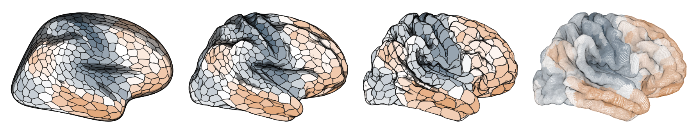

<table>
  <tr>
    <td>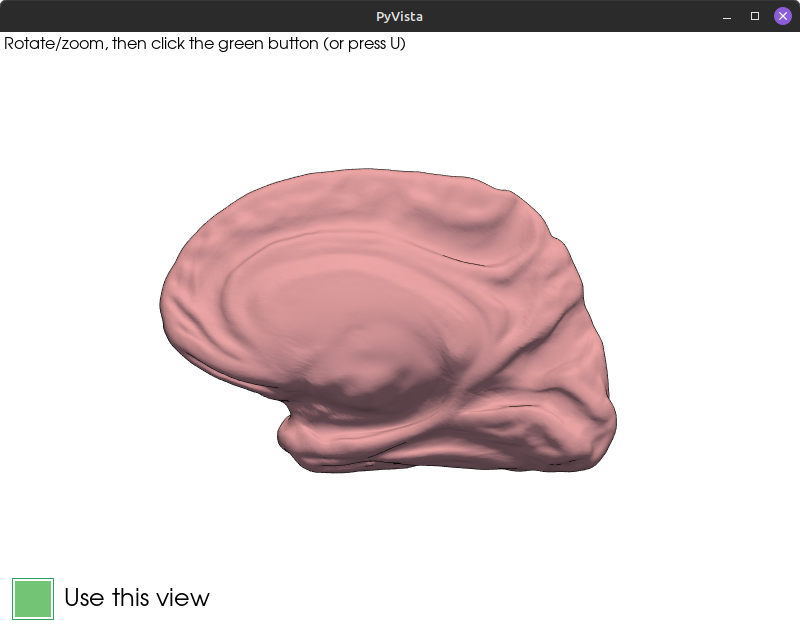</td>
    <td></td>
    <td>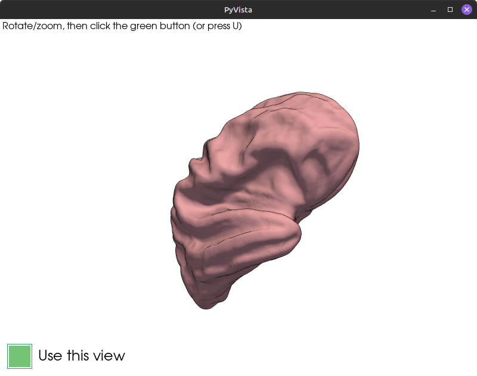</td>
    <td>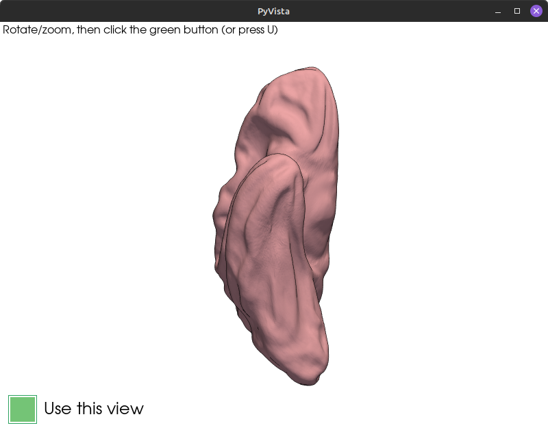</td>
  </tr>
</table>

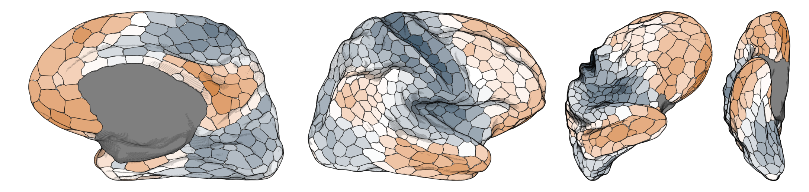

The package supports many atlases and types but as long as you have a surface with corresponding labels (freesurfer, giftis, .vtp meshes) you can kind of build from whatever you want. 
E.g. this surface rendering of the medial temporal lobe (waddup @pyushkevich), however, the shading and region boundaries will be better the higher the detail of the mesh. 

<table>
  <tr>
    <td>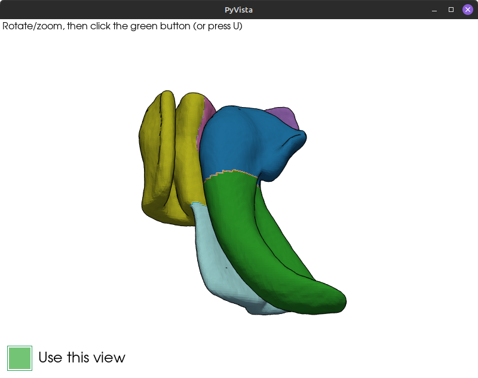</td>
    <td>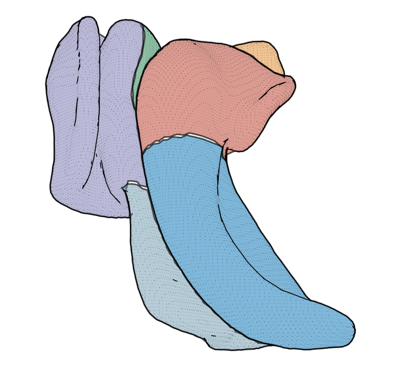</td>
  </tr>
</table>

Furthermore, the package lets you create surface meshes from nifti atlases (I've only tested this with subcortical atlases as of yet), from which you then can build 2D atlases. 

Here is an example of the aseg atlas:
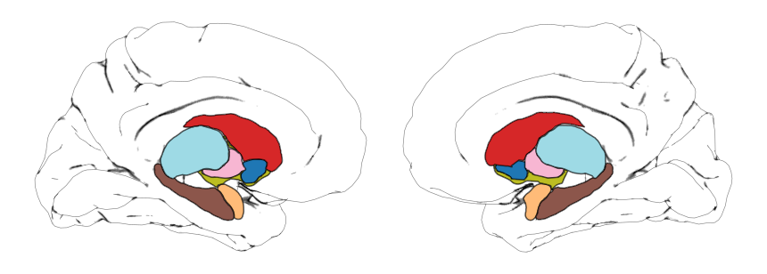

Of course, if you prefer to visualize the subcortex in volume space that is also possible, and with the help of the packages slice selector 
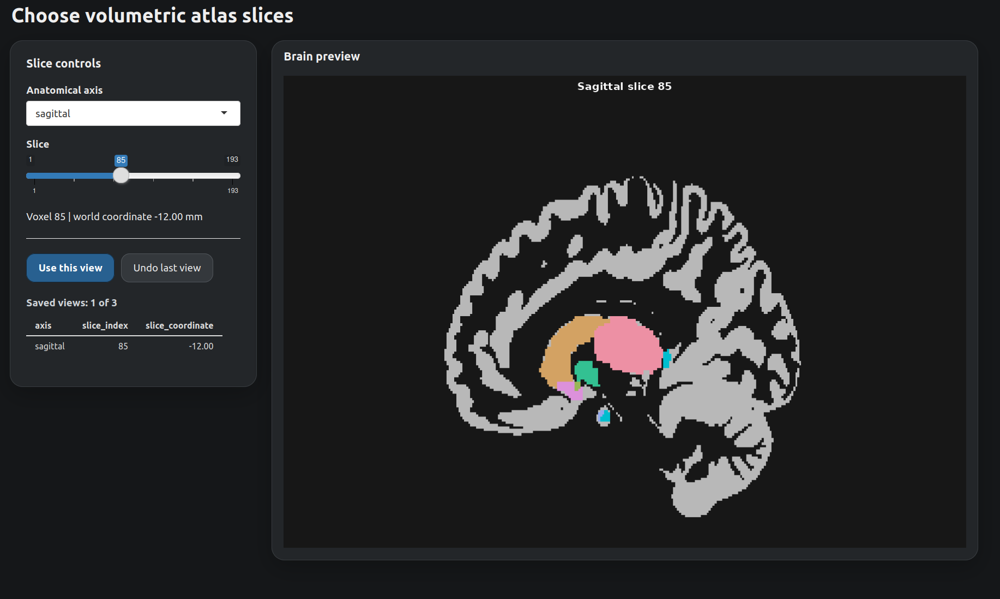

you can choose whichever slices you want in your atlas (there are also presets for both the surface based view selector and the volumetic counterpart).


Have you drawn your own atlas in inkscape or some other vector based illustration software that we don't mention by name? No problem! If you've set up 
your drawing properly you can just import it as a ready to go atlas file with the click of a button.

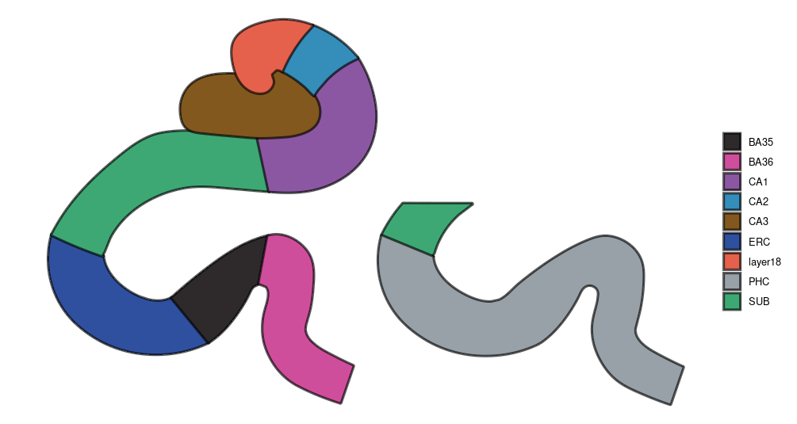

(courtesy of Anika Wuestefeld)

### The name of the game

This package is about versatility, but within the limits of ggplot. As brain imagers favoring R (or perhaps ggplot) this is
a tradeoff we have to deal with. Since ggplot is inherently a two dimensional plotting library, and the brain
is a three dimensional object, ggplot will never be able to compete with proper 3D rendering software in terms of
getting that sexy 3D look. However, what we lose in sexiness we gain in analytical versatility. As most of you know
ggplot is extremely versatile, especially with the numerous extensions that are being built around it making data exploration
very easy compared to many other libraries. This was the reason that I did not want to wrap functionality around functions
already handled by ggplot (and sf). All utilities and functionality that supports `geom_sf()` can be used with `ggbrat`'s atlases.

To get the "3D look" with the `ggbrat` atlases we are using a trick. Basically we are taking a fraction of all the vertices from 
the original mesh, sampled by their density and plot them as an additional layer. You then control the strength of the "shade" by 
adjusting the size and opacity of the multipoints.

```r
data("gradients")    # This is just some data in the same parcellation as below

schaefer <- load_atlas("Schaefer2018_1000Parcels_7Networks_order")
p1 <- schaefer$atlas |> 
  left_join(gradients) |> 
  ggplot()+
  geom_sf(aes(fill = gradient1), linewidth = 0.5, show.legend = FALSE) +
  scale_fill_gradient2(high = c("#D38A4E"), low = "#3F596D") +
  scale_color_identity() +
  theme_void()
  
p2 <- schaefer$atlas |> 
  left_join(gradients) |> 
  ggplot()+
  geom_sf(aes(fill = gradient1), linewidth = 0.5, show.legend = FALSE) +
  geom_sf(data = schaefer$shade, size = 0.1, alpha = 0.075) +
  scale_fill_gradient2(high = c("#D38A4E"), low = "#3F596D") +
  scale_color_identity() +
  theme_void()
```

We can even add another additional layer from a different atlas, which may be of interest if you are interested in your brain
statistics across various networks. 

```r
yeo <- load_atlas("Yeo2011_7Networks_N1000")
yeo$atlas <- yeo$atlas |> shrink_polygons(dist = 0.007) |> smooth_polygons(smoothness = 5)

p3 <- schaefer$atlas |> 
  left_join(gradients) |> 
  ggplot()+
  geom_sf(aes(fill = gradient1), linewidth = 0.5, show.legend = FALSE) +
  geom_sf(data = schaefer$shade, size = 0.1, alpha = 0.075) +
  geom_sf(data = yeo$atlas, aes(color = color), size = 1) +
  scale_fill_gradient2(high = c("#D38A4E"), low = "#3F596D") +
  scale_color_identity() +
  theme_void()
  
patchwork::wrap_plots(list(p1, p2, p3), nrow = 1)
``` 

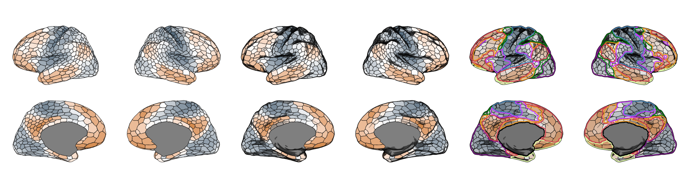


You can also very easily animate your brain data using these atlases, with the help of the fantastic `gganimate`:

```r
schaefer1k <- download_annotation("annotation-schaefer2018-1000parcels-7networks-order")
atlas_point <- build_brain_atlas(
  surface = c("pial"),
  annot_path = schaefer1k,
  create_polygons = FALSE,
  shade_keep_quantile = 0.4,
  hemi = "right",
  n_views = 1)
  
library(gganimate)

atlas_point$atlas |> 
  left_join(grads |> mutate(across(where(is.numeric), scale))
            ) |> 
  pivot_longer(starts_with("grad"), names_to = "gradient", values_to = "values") |> 
  ggplot()+
  geom_sf(aes(color = values), size = 0.05, alpha = 1, show.legend = FALSE) +
  geom_sf(data = atlas_point$shade, size = 0.1, alpha = 0.075, color = "black") +
  scale_color_gradient2(high = c("#D38A4E"), low = "#3F596D") +
  theme_void() +
  transition_states(
    gradient,
    transition_length = 0.5,
    state_length = 0.1,
    wrap = TRUE
  )

```


So, the package separates atlas creation from atlas use. Any `ggbrat` atlas is just 
a simple features object/collection like any other. While creating these atlases (at least the surface based ones)
require python and specifically `vtk` (trust me, I tried to do everything in R, but sometimes R just says "no"),
once an atlas has been built and saved as an RDS file, plotting and
sharing it are ordinary R workflows and do not require Python and frankly do not 
even require this package any more. You just load the atlas up, join it with your data and 
plot it (it does require `sf` though). 

> [!NOTE]
> ggbrat is under active development. The function interface and downloadable
> resource catalog may change before the first stable release.

## Installation

Install the development version from GitHub:

```r
# install.packages("pak")
pak::pak("jorittmo/ggbrat")
```

Plotting premade atlases, resource-download, volumetric, and SVG functionality requires R only.
Surface projection and NIfTI-to-mesh conversion additionally
require Python 3.9 or newer. With `reticulate >= 1.41`, ggbrat declares the
required Python packages when those functions are first used. The principal
Python dependencies are `nibabel`, `numpy`, `pandas`, `pyvista`, `vtk`,
`scipy`, and `scikit-image`. I tried to make everything all R but after having banged my head
against the wall for far too long I gave up. 

## Start with a premade atlas

So, available resources are listed in the bundled catalog. These resources are
used when either building atlases or when calling a pre-made atlas. Since R packages 
are not allowed to be larger than a few mbs, the package ships only with a few examples. The
rest of the resources have to be downloaded on demand. They are then cached and ready to be used
whenever.

```r
library(ggbrat)

list_resources(type = "atlas")
```

`load_atlas()` downloads an atlas when necessary, stores it in the
user-specific ggbrat cache, and returns the R object:

```r
yeo <- load_atlas("Yeo2011_7Networks_N1000")
```

Premade surface atlases are lists containing the region polygons and, where
available, silhouettes, shading points, cortex points, and saved camera
positions. The main atlas can be plotted with `geom_sf()`:

```r
library(ggplot2)

ggplot(yeo$atlas) +
  geom_sf(aes(fill = region), colour = "white", linewidth = 0.15) +
  facet_wrap(~view) +
  coord_sf(datum = NA) +
  theme_void() +
  guides(fill = "none")
```

The cache location can be inspected or changed:

```r
ggbrat_cache_dir()

# Set before downloading resources:
options(ggbrat.cache_dir = "/path/to/another/cache")
```

But there are several other resource files you may need. The main helper functions are:

```r
download_atlas()
download_annotation()
download_surface()
download_volume_atlas()
```

Check `list_resources()` for the resource that you need. 

Use `"all"` to download an entire category, for example
`download_annotation("all")`. Use `remove_resource()` or
`clear_resource_cache()` to remove cached resources.


## Build a cortical surface atlas

Download a paired annotation and pass it to `build_brain_atlas()`. When
`surf_dir = NULL`, the requested fsaverage surface is downloaded and resolved
from the same cache automatically.

```r
annotation <- download_annotation("aparc")

cortical <- build_brain_atlas(
  annot_path = annotation,
  surface = "inflated",
  interactive = TRUE,
  n_views = 2,
  view_names = c("lateral", "medial")
)
```

In the interactive PyVista window, position the surface and select **Use this
view** (or press `U`) for every requested view. The saved camera positions can
be reused to make subsequent builds deterministic.

Two compatible surfaces can be blended before projection:

```r
cortical <- build_brain_atlas(
  annot_path = annotation,
  surface = c("inflated", "pial"),
  surf_blend_ratio = 0.8,
  interactive = TRUE,
  n_views = 2,
  view_names = c("lateral", "medial")
)
```

FreeSurfer `.annot` and GIFTI `.label.gii` annotations are supported, as are
FreeSurfer surfaces and GIFTI `.surf.gii` surfaces supplied explicitly through
`surface_path`.

## Build a subcortical surface atlas

To do this you would generally need to create surface meshes from NIfTI atlases.
You can do that through `ggbrat` by using `nifti_to_surface()`. This function
extracts each nonzero region independently and combines
the labelled components into one VTP mesh. Hemispherical atlases can instead be
written as a left/right pair.

```r
melbourne_files <- download_volume_atlas("Melbourne_S1")

surface <- nifti_to_surface(
  nifti_path = melbourne_files$nifti,
  lookup_path = melbourne_files$lookup,
  split_hemispheres = TRUE,
  voxel_smoothing_sigma = 1.5,
  smoothing_iterations = 25,
  smoothing_factor = 0.2
)
```
Generated meshes are written to the ggbrat cache by default. Supply
`output_file` when a particular destination is required.


However, I have already created several meshes from subcortical atlases, so if you don't 
want to create your own (or try to improve on my bad ones), you can download a prepared labelled mesh 
and project it through the same builder as for the cortical:

```r
mesh <- download_surface("Melbourne_S1", type = "subcortical")

subcortical <- build_brain_atlas(
  mesh_path = mesh,
  add_cortex = TRUE,
  interactive = TRUE,
  n_views = 2,
  view_names = c("lateral", "medial")
)
```

`add_cortex = TRUE` adds a cortical glass-brain context. Set
`create_polygons = FALSE` to retain region point clouds instead of converting
them to alpha-hull polygons. With `keep_z_coord = TRUE`, those multipoints also
retain projected display depth.

If a VTP file uses another point-data array for its region labels, identify it
with `region_array`:

```r
custom <- build_brain_atlas(
  mesh_path = "my_labelled_mesh.vtp",
  region_array = "Label",
  interactive = TRUE
)
```


## Build orthogonal views from a volume

`build_atlas_vol()` creates axial, sagittal, and coronal `sf` polygons directly
from a discrete NIfTI atlas. By default it adds a thresholded gray-matter
probability map and selects the plane nearest world coordinate zero. `smooth_iterations` sets
the smoothing of the regions that otherwise can appear a bit "blocky". 

```r
melbourne_files <- download_volume_atlas("Melbourne_S1")

volume_atlas <- build_atlas_vol(
  atlas_path = melbourne_files$nifti,
  lookup_path = melbourne_files$lookup,
  smooth_iterations = 1.5,
  gray_matter_smooth_iterations = 0.5
)

ggplot(volume_atlas) +
  geom_sf(aes(fill = region), linewidth = 0.15) +
  facet_wrap(~view) +
  theme_void()
```

Set `interactive = TRUE` to open the optional Shiny slice selector, switch
between anatomical axes, scroll through the volume, and save the requested
views.

## Build an atlas from SVG

`build_atlas_svg()` reads labelled SVG groups into `sf`. New drawings should
contain one named layer or group per region, with each anatomical boundary
authored as a closed path. This preserves the intended geometry without hull
reconstruction.

```r
svg_atlas <- build_atlas_svg(
  svg_path = file.choose(),
  geometry_method = "path"
)

ggplot(svg_atlas) +
  geom_sf(aes(fill = region), colour = "black") +
  theme_void()
```

Legacy drawings made from stroke outlines (potentially also when converting from Illustrator to inkscape) can use
`geometry_method = "concaveman"`. That mode requires the suggested `concaveman` package.


## TemplateFlow

The package also provides a small interface to the official TemplateFlow
Python client:

```r
templateflow_templates()

files <- templateflow_get(
  template = "fsaverage",
  atlas = "Desikan2006",
  density = "164k"
)
```

TemplateFlow files are returned as paths and can be supplied explicitly to
`build_brain_atlas()`. Use `templateflow_citations()` to retrieve the requested
template's citation information.

## Development status

Bug reports and feature discussions are welcome in the
[GitHub issue tracker](https://github.com/jorittmo/ggbrat/issues). Because the
package and resource repository are currently prerelease software, please
include the ggbrat version and the output of `sessionInfo()` when reporting a
problem.
