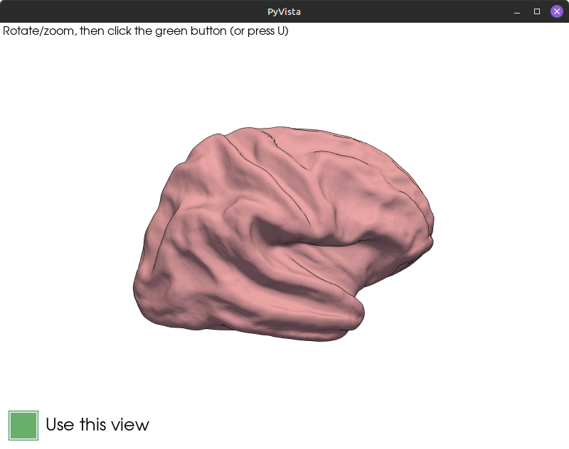
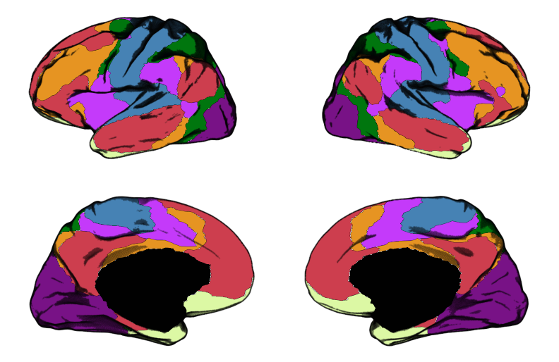

# ggbrat: Brain Atlases for ggplot2!

Do you use ggplot to visualize imaging data on brain atlases? Welcome to
ggbrat: brain atlases for ggplot2!

There is, of course, already the wonderful and popular
[`ggseg`](https://ggseg.github.io/ggseg/) package for this particular
purpose (and
[`subcortex_visualization`](https://github.com/anniegbryant/subcortex_visualization)
for subcortex), but ggbrat offers something slightly different. While
`ggseg` provides prebuilt atlases and modified `geoms`, the focus of
ggbrat is to provide tools for building the 2D atlases themselves
(although it also comes with many prebuilt atlases). ggbrat builds
two-dimensional brain atlases that work directly with
[`ggplot2`](https://ggplot2.tidyverse.org/) and
[`sf`](https://r-spatial.github.io/sf/). It can turn cortical
annotations, labelled (subcortical) surface meshes, volumetric NIfTI
atlases, and labelled SVG drawings into plot-ready `sf` geometry, from
whatever view angle you want. No more PNG snapshots and outlining; it is
all automatic!

The origin of this package stemmed from me wanting to visualize my brain
data using ggplot with a bit more cortical texture (I mean the brain
looks cool, no?). And since I really don’t like doing things manually,
and because the brain is cool from many different angles, I developed an
interactive view selector that can derive 3D looking 2D atlases from any
camera angle in just a few seconds.

Example surfaces/textures (plotted only using `ggplot`):


Example of four view angles rendered to 2D:

|  |  |  |  |
|----|----|----|----|
|  |  |  |  |


The package supports many atlases and file types. As long as you have a
surface (or volume) with corresponding labels (FreeSurfer, GIFTI, or
`.vtp` meshes), you can kind of build from whatever you want. For
example, here is a surface rendering of the medial temporal lobe (shout
out to @pyushkevich). The shading and region boundaries will, however,
be better the more detailed the mesh is.

|  |  |
|----|----|
|  |  |

Furthermore, the package lets you create surface meshes from NIfTI
atlases (I’ve only tested this with subcortical atlases as of yet), from
which you can then build 2D atlases.

Here is an example of the aseg atlas:


Of course, if you prefer to visualize the subcortex in volume space,
that is also possible. The package’s slice selector lets you choose
whichever slices you want in your atlas.


There are also presets for both the surface-based view selector and its
volumetric counterpart.


Have you drawn your own atlas in Inkscape, or some other vector-based
illustration software that we don’t mention by name? No problem! If
you’ve set up your drawing properly, you can just import it as a
ready-to-go atlas file with the click of a button.


Medial temporal lobe atlas imported from an SVG drawing

(courtesy of Anika Wuestefeld)

## The name of the game

This package is about versatility, but within the limits of ggplot. As
brain imagers favoring R (or perhaps ggplot), this is a tradeoff we have
to deal with. Since ggplot is inherently a two-dimensional plotting
library, and the brain is a three-dimensional object, ggplot will never
be able to compete with proper 3D rendering software in terms of getting
that sexy 3D look. However, what we lose in sexiness we gain in
analytical versatility. As most of you know, ggplot is extremely
versatile, especially with the numerous extensions built around it,
making data exploration very easy compared to many other libraries. This
was the reason that I did not want to wrap functionality around
functions already handled by ggplot (and sf). All utilities and
functionality that support
[`geom_sf()`](https://ggplot2.tidyverse.org/reference/ggsf.html) can be
used with `ggbrat`’s atlases.

To get the “3D look,” ggbrat can retain a density-sampled fraction of
the original mesh vertices and plot them as an additional shade layer.
That shade, overlays from other atlases, and even animations are still
ordinary ggplot layers. See [Plotting ggbrat
atlases](https://jorittmo.github.io/ggbrat/articles/plotting-atlases.md)
for the full examples.

So, the package separates atlas creation from atlas use. Any `ggbrat`
atlas is just a Simple Features object/collection like any other. While
creating these atlases (at least the surface-based ones) requires Python
and specifically `vtk` (trust me, I tried to do everything in R, but
sometimes R just says “no”), once an atlas has been built and saved as
an RDS file, plotting and sharing it are ordinary R workflows and do not
require Python and frankly do not even require this package anymore. You
just load the atlas up, join it with your data, and plot it (it does
require `sf` though).

> \[!NOTE\] ggbrat is under active development. The function interface
> and downloadable resource catalog may change before the first stable
> release.

## Quick start

Install the development version from GitHub:

``` r

# install.packages("pak")
pak::pak("jorittmo/ggbrat")
```

Load a premade atlas and plot it:

``` r

library(ggbrat)
library(ggplot2)

yeo <- load_atlas("Yeo2011_7Networks_N1000")

ggplot(yeo$atlas) +
  geom_sf(aes(fill = color), linewidth = 0.15) +
  geom_sf(data = yeo$shade, size = 0.1, alpha = 0.1) +
  scale_fill_identity() +
  theme_void() 
```



[`load_atlas()`](https://jorittmo.github.io/ggbrat/reference/load_atlas.md)
downloads the atlas when necessary and keeps it in the user-specific
ggbrat cache for next time.

For more detail, head over to:

- [Plotting ggbrat
  atlases](https://jorittmo.github.io/ggbrat/articles/plotting-atlases.md)
- [Resources and
  caching](https://jorittmo.github.io/ggbrat/articles/resources-and-caching.md)
- [Building surface
  atlases](https://jorittmo.github.io/ggbrat/articles/building-surface-atlases.md)
- [Building volumetric
  atlases](https://jorittmo.github.io/ggbrat/articles/building-volume-atlases.md)
- [Building SVG
  atlases](https://jorittmo.github.io/ggbrat/articles/building-svg-atlases.md)
- [Using
  TemplateFlow](https://jorittmo.github.io/ggbrat/articles/templateflow.md)
- [Function
  reference](https://jorittmo.github.io/ggbrat/reference/index.md)

Plotting premade atlases, downloading resources, and using the
volumetric and SVG functionality require R only. Surface projection and
NIfTI-to-mesh conversion additionally require Python 3.9 or newer. With
`reticulate >= 1.41`, ggbrat declares the required Python packages when
those functions are first used. I tried to make everything all R, but
after having banged my head against the wall for far too long I gave up.

## Acknowledgements

All atlases and resources in this package comes from the enormous work
of the neuroimaging community. Source citation should be available for
each resource and you can find them by browsing:

``` r

list_resources()
```

If you use any of them in your work, please cite the original sources.

Available premade atlases can be found below. This will be updated as
new atlases gets added, but I encourage you to crate your own 2D
rendering instead!

| Name | Source |
|:---|:---|
| AICHA_subcortex | Joliot M, Jobard G, Naveau M, et al. (2015) |
| aparc | Desikan RS, Segonne F, Fischl B, et al. (2006) |
| aparc.a2005s | Fischl B, van der Kouwe A, Destrieux C, et al. (2004) |
| aparc.a2009s | Destrieux C, Fischl B, Dale A, Halgren E (2010) |
| aseg_subcortex | Fischl B, Salat DH, Busa E, et al. (2002) |
| Brainnetome_subcortex | Fan L, Li H, Zhuo J, et al. (2016) |
| Brainstem_Navigator | Bianciardi M and the Brainstem Imaging Laboratory (2024) |
| CIT168_subcortex | Pauli WM, Nili AN, Tyszka JM (2018) |
| HCP-MMP1 | Glasser MF, Coalson TS, Robinson EC, et al. (2016) |
| HO_FSSpace | Harvard Center for Morphometric Analysis and FMRIB Software Library. RRID:SCR_001476. |
| Melbourne_S1 | Tian Y, Margulies DS, Breakspear M, Zalesky A (2020) |
| Melbourne_S2 | Tian Y, Margulies DS, Breakspear M, Zalesky A (2020) |
| Melbourne_S3 | Tian Y, Margulies DS, Breakspear M, Zalesky A (2020) |
| Melbourne_S4 | Tian Y, Margulies DS, Breakspear M, Zalesky A (2020) |
| PALS_B12_Brodmann | Van Essen DC (2005) |
| PALS_B12_Lobes | Van Essen DC (2005) |
| Schaefer2018_1000Parcels_17Networks_order | Schaefer A, Kong R, Gordon EM, et al. (2018) |
| Schaefer2018_1000Parcels_7Networks_order | Schaefer A, Kong R, Gordon EM, et al. (2018) |
| Schaefer2018_100Parcels_17Networks_order | Schaefer A, Kong R, Gordon EM, et al. (2018) |
| Schaefer2018_100Parcels_7Networks_order | Schaefer A, Kong R, Gordon EM, et al. (2018) |
| Schaefer2018_200Parcels_17Networks_order | Schaefer A, Kong R, Gordon EM, et al. (2018) |
| Schaefer2018_200Parcels_7Networks_order | Schaefer A, Kong R, Gordon EM, et al. (2018) |
| Schaefer2018_300Parcels_17Networks_order | Schaefer A, Kong R, Gordon EM, et al. (2018) |
| Schaefer2018_300Parcels_7Networks_order | Schaefer A, Kong R, Gordon EM, et al. (2018) |
| Schaefer2018_400Parcels_17Networks_order | Schaefer A, Kong R, Gordon EM, et al. (2018) |
| Schaefer2018_400Parcels_7Networks_order | Schaefer A, Kong R, Gordon EM, et al. (2018) |
| Schaefer2018_500Parcels_17Networks_order | Schaefer A, Kong R, Gordon EM, et al. (2018) |
| Schaefer2018_500Parcels_7Networks_order | Schaefer A, Kong R, Gordon EM, et al. (2018) |
| Schaefer2018_600Parcels_17Networks_order | Schaefer A, Kong R, Gordon EM, et al. (2018) |
| Schaefer2018_600Parcels_7Networks_order | Schaefer A, Kong R, Gordon EM, et al. (2018) |
| Schaefer2018_700Parcels_17Networks_order | Schaefer A, Kong R, Gordon EM, et al. (2018) |
| Schaefer2018_700Parcels_7Networks_order | Schaefer A, Kong R, Gordon EM, et al. (2018) |
| Schaefer2018_800Parcels_17Networks_order | Schaefer A, Kong R, Gordon EM, et al. (2018) |
| Schaefer2018_800Parcels_7Networks_order | Schaefer A, Kong R, Gordon EM, et al. (2018) |
| Schaefer2018_900Parcels_17Networks_order | Schaefer A, Kong R, Gordon EM, et al. (2018) |
| Schaefer2018_900Parcels_7Networks_order | Schaefer A, Kong R, Gordon EM, et al. (2018) |
| SUIT_cerebellar_lobule | Diedrichsen J, Balsters JH, Flavell J, Cussans E, Ramnani N (2009) |
| Thalamus_HCP | Najdenovska E, Aleman-Gomez Y, Battistella G, et al. (2018) |
| Thalamus_THOMAS | Su JH, Thomas FT, Kasoff WS, et al. (2019) |
| Yeo2011_17Networks_N1000 | Yeo BTT, Krienen FM, Sepulcre J, et al. (2011) |
| Yeo2011_7Networks_N1000 | Yeo BTT, Krienen FM, Sepulcre J, et al. (2011) |
