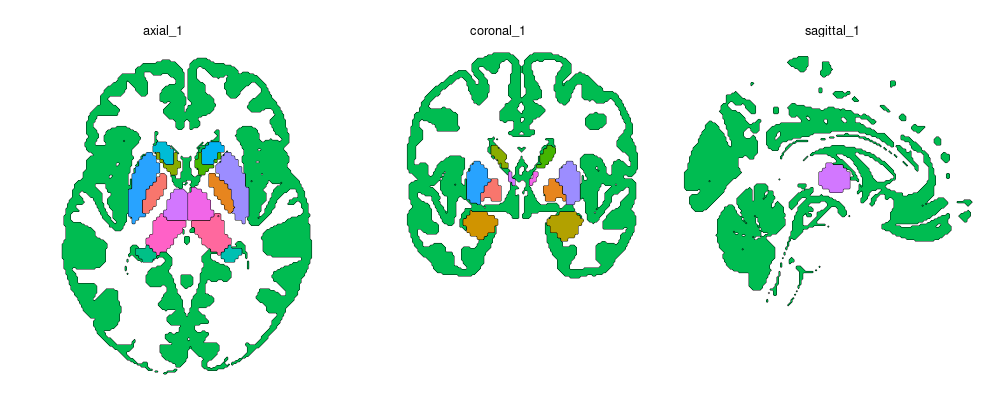
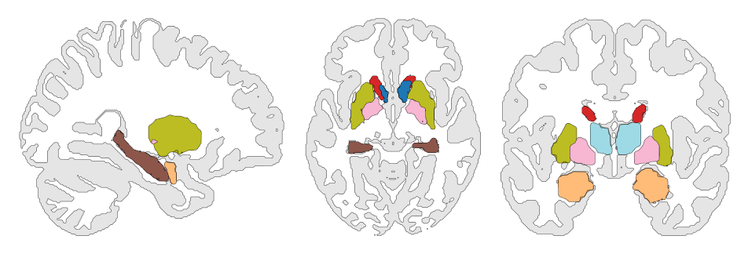

```{r, include = FALSE}
knitr::opts_chunk$set(
  collapse = TRUE,
  comment = "#>",
  eval = FALSE
)
```

```{r setup}
library(ggbrat)
library(ggplot2)
```

`build_atlas_vol()` combines a discrete-label atlas with a thresholded gray
matter or anatomical context image and converts selected slices directly into
`sf` polygons. This workflow is entirely in R and does not use hull
reconstruction (which we do to create the polygons from the surface meshes).

The atlas and context image must have identical dimensions and voxel-to-world
transformations.

## Build the midline views

```{r}
melbourne <- download_volume_atlas("Melbourne_S1")

atlas <- build_atlas_vol(
  atlas_path = melbourne$nifti,
  lookup_path = melbourne$lookup
)

ggplot(atlas) +
  geom_sf(aes(fill = region), show.legend = FALSE, colour = "black", linewidth = 0.15) +
  facet_wrap(~view) +
  theme_void()
```



By default, ggbrat chooses the planes nearest world coordinate zero for the
axial, sagittal, and coronal axes. Choose coordinates explicitly when you
already know the slices:

```{r}
atlas <- build_atlas_vol(
  atlas_path = melbourne$nifti,
  lookup_path = melbourne$lookup,
  views = c("axial", "coronal"),
  slice_coordinates = c(axial = 12, coronal = -18)
)
```

## Choose slices interactively

If finding the correct coordinates by hand sounds joyless, use the Shiny slice
selector:

```{r}
atlas <- build_atlas_vol(
  atlas_path = melbourne$nifti,
  lookup_path = melbourne$lookup,
  interactive = TRUE,
  n_views = 4
)
```

Switch between anatomical axes, scroll through the volume, and click **Use this
view** until all requested views are saved. The result records `axis`,
axis-specific `int_view`, and a combined `view` such as `"axial_2"`.


The interactive selector uses the suggested `shiny` package:

```{r}
install.packages("shiny")
```

## Control the gray-matter context

When `gray_matter_path = NULL`, ggbrat resolves the standard gray-matter
probability map from its resource cache. It is thresholded at 0.5 by default.

```{r}
atlas <- build_atlas_vol(
  atlas_path = melbourne$nifti,
  lookup_path = melbourne$lookup,
  gray_matter_threshold = 0.6,
  gray_matter_region = NA_character_
)
```

Use `gray_matter_region = NA_character_` when the context should not be treated
as an atlas region. Set `include_gray_matter = FALSE` to omit it entirely.

## Smooth the two kinds of outline separately

Atlas regions and the broad gray-matter outline rarely want the same amount of
smoothing. Control them independently:

```{r}
atlas <- build_atlas_vol(
  atlas_path = melbourne$nifti,
  lookup_path = melbourne$lookup,
  smooth_iterations = 2,
  gray_matter_smooth_iterations = 0.5
)
```

These controls use geometric buffers and simplification, so they round
stair-step boundaries without multiplying the number of vertices on every
iteration. Fractional values are supported. Start small: too much smoothing can
erase narrow structures.


