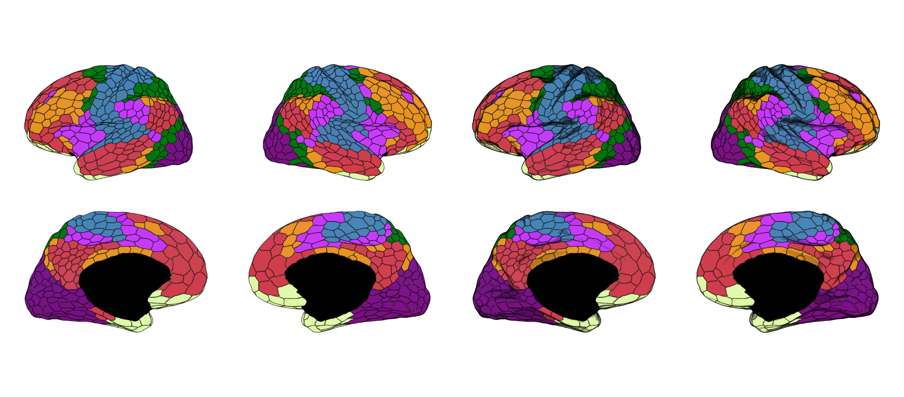
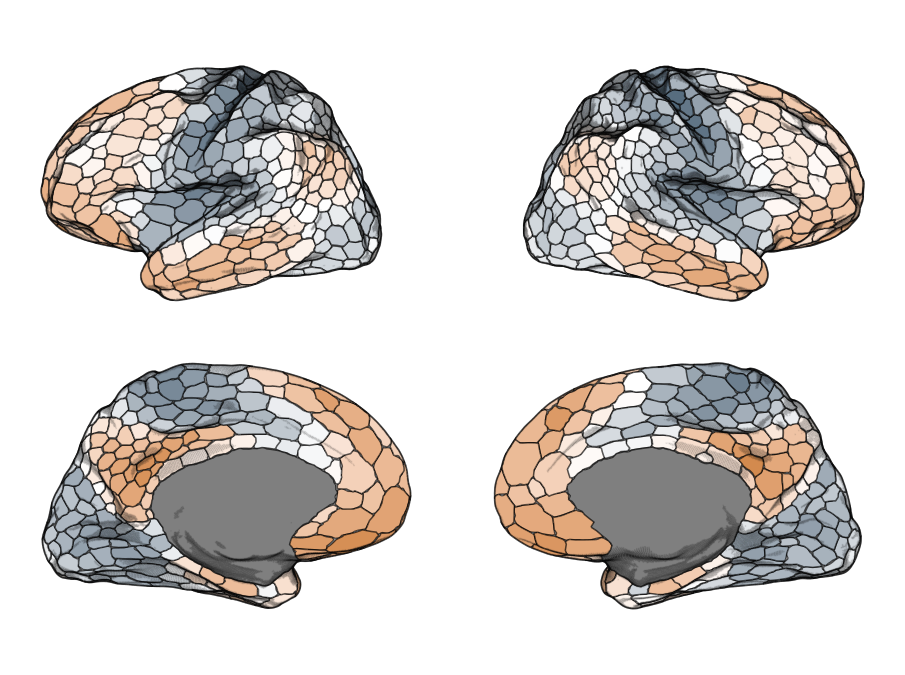
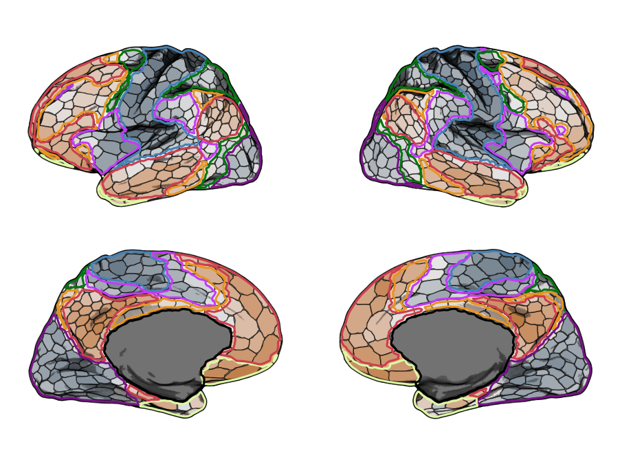

```{r, include = FALSE}
knitr::opts_chunk$set(
  collapse = TRUE,
  comment = "#>",
  eval = FALSE
)
```

Any `ggbrat` atlas is just a Simple Features object/collection like any other. You load the atlas up, join it with your data, and plot it. All utilities and functionality that support `geom_sf()` can be used with a ggbrat atlas.

```{r setup}
library(ggbrat)
library(dplyr)
library(ggplot2)
library(tidyr)
```

## Start with a premade atlas

`load_atlas()` downloads an atlas when necessary, stores it in the user-specific ggbrat cache, and returns the R object:

```{r}
schaefer <- load_atlas("Schaefer2018_1000Parcels_7Networks_order")
```

Premade surface atlases are lists containing the region polygons and, where available, silhouettes, shading points, cortex points, and saved camera positions. To get the "3D look" with a 2D ggplot atlas, we are using a trick. Basically, we take a fraction of all the vertices from the original surface mesh, sampled by their density, and plot them as an additional layer. You control the strength of the shade by adjusting the size and opacity of the multipoints. In the ggbrat list the main atlas is in `atlas`, and if you want to add shading you find multipoint geometries in `shade`. 

```{r}
p1 <- ggplot(schaefer$atlas) +
  geom_sf(aes(fill = color), linewidth = 0.4, show.legend = FALSE) +
  scale_fill_identity() +
  theme_void() 

p2 <- ggplot(schaefer$atlas) +
  geom_sf(aes(fill = color), linewidth = 0.4, show.legend = FALSE) +
  geom_sf(data = schaefer$shade, size = 0.05, alpha = 0.05) +
  scale_fill_identity() +
  theme_void() 

patchwork::wrap_plots(list(p1, p2))
```



Note that the multipoints are relatively computationally expensive to plot, so if you just want to quickly visualize something it is better to turn that layer off until you want to render the proper figure.

## Join the atlas with data

The package includes the first five cortical gradients from Margulies et al. (2016), represented for the 1,000 parcels of the Schaefer atlas. We use them here
as example data.

```{r}
data("gradients")

schaefer$atlas |>
  left_join(grads, by = "region") |>
  ggplot() +
  geom_sf(aes(fill = gradient1), linewidth = 0.5, show.legend = FALSE) +
  geom_sf(data = schaefer$shade, size = 0.05, alpha = 0.05) +
  scale_fill_gradient2(high = "#D38A4E", low = "#3F596D") +
  theme_void()
```



## Add another atlas

We can even add an additional layer from a different atlas, which may be useful if you are interested in your brain statistics across various networks. Since the polygons boundaries sit tightly we shrink and smooth them a little bit to get a nicer looking overlay using the helper functions `shrink_polygons()` and `smooth_polygons()`.

```{r}
yeo <- load_atlas("Yeo2011_7Networks_N1000")
yeo$atlas <- yeo$atlas |>
  shrink_polygons(dist = 0.007) |>
  smooth_polygons(smoothness = 5)

schaefer$atlas |>
  left_join(grads, by = "region") |>
  ggplot() +
  geom_sf(aes(fill = gradient1), linewidth = 0.5, show.legend = FALSE) +
  geom_sf(data = schaefer$shade, size = 0.1, alpha = 0.075) +
  geom_sf(data = yeo$atlas, aes(color = color), size = 1) +
  scale_fill_gradient2(high = "#D38A4E", low = "#3F596D") +
  scale_color_identity() +
  theme_void()

```



## Animate brain data

You can also very easily animate your brain data using these atlases, with the help of the fantastic `gganimate`. Here I am also showcasing another way to represent
the cortical texture, namely through multipoints instead of polygons. I think this is probably more an aesthetic thing and likely not as useful from a scientific point
of view, but I think it's pretty cool. It makes a purely pial surface actually look quite okay in 2D. You can generate such atlases by setting `create_polygons` to `FALSE`. 

```{r}
schaefer1k <- download_annotation(
  "annotation-schaefer2018-1000parcels-7networks-order"
)

atlas_point <- build_atlas_surf(
  surface = "pial",
  annot_path = schaefer1k,
  create_polygons = FALSE,
  shade_keep_quantile = 0.4,
  hemi = "right",
  n_views = 1
)

library(gganimate)

animation <- atlas_point$atlas |>
  left_join(
    grads |> mutate(across(where(is.numeric), scale)),
    by = "region"
  ) |>
  pivot_longer(
    starts_with("grad"),
    names_to = "gradient",
    values_to = "values"
  ) |>
  ggplot() +
  geom_sf(aes(color = values), size = 0.05, show.legend = FALSE) +
  geom_sf(
    data = atlas_point$shade,
    size = 0.1,
    alpha = 0.075,
    color = "black"
  ) +
  scale_color_gradient2(high = "#D38A4E", low = "#3F596D") +
  theme_void() +
  transition_states(
    gradient,
    transition_length = 0.5,
    state_length = 0.1,
    wrap = TRUE
  )
```


